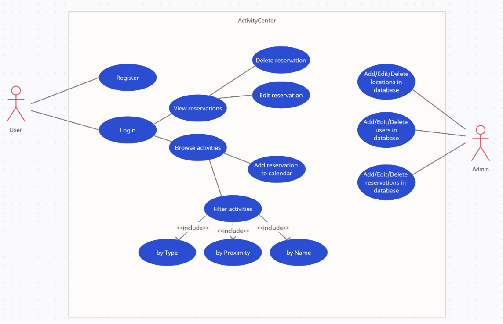
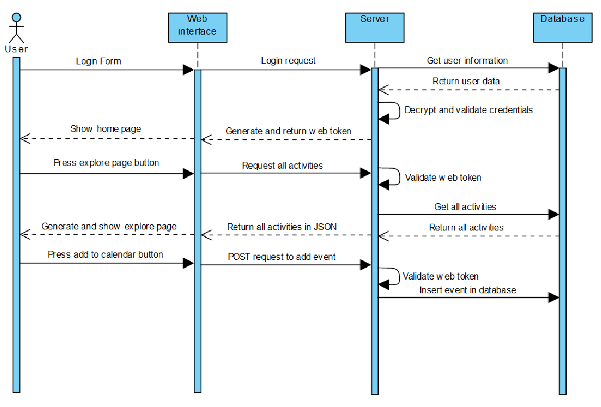

# ActivityCenter-ClientServerWebsite

## Abstract
In acest proiect s-a dezvoltat o aplicatie client-server folosind technicile de programare invatate la curs,
partea de server fiind implementata in limbajul Java iar cea de interfata cu utilizatorul in JavaScript si
framework-ul Vue. Proiectul numit “Activity Center” reprezinta o pagina web ce arata utilizatorului ce
puncta de interes se afla in jurul sau. Aplicatia este o unealta foarte utila pentru persoanele care
viziteaza un oras nou si doresc sa afle ce activitati se desfasoara in jur, de la restaurante pana la cluburi
si hoteluri.
## Functionalitati
Proiectul are implementat un sistem de inregistrare si logare. Utilizatorul va fi capabil sa vizualizeze
toate pucntele de interes din jurul sau, sa le filtreze dupa anumiti parametrii, sa le vizualizeze locatia pe
o harta si sa isi programeze in calendar o data si ora cand vrea sa participe la respectivele activitati.

## Descriere detaliata proiect

In imaginea de mai sus se poate observa diagrama de use-case.
Utilizatorul este intampinat de o pagina Home, iar folosind butoanele din partea superioara a paginii,
acesta se poate indrepta fie spre pagina de login, fie spre cea de inregistrare.
Field-urile din form-ul de inregistrare sunt verificate in cazul introducerii de date invalide, cum ar fi
verificarea formatului mail-ului sau daca sunt campuri goale.
Odata logat, utilizatorul are acces la pagina de Explore. Pagina ii permite sa vizualizeze toate punctele de
interes din jur, si sa le filtreze in 3 moduri:
• Dupa nume: se introduce in caseta text un keyword dupa care se filtreaza numele activitatilor
• Dupa tip: se alege unul dintre tipurile: Food, Hotel, Entertainment
• Dupa proximitate: se introduce in caseta text distanta pana la care se vor filtra activitatile in km.
Pagina Explore dispune de o harta in care vor fi automat adaugate semne la locatia fiecarei activitati
afisate.
Butonul „Show on map” din dreptul activitatii ne va focaliza harta la punctul respectiv de interes.
Prin apasarea butonului „Add to calendar” din dreptul unei activitati, utilizatorul introduce in baza de
date o activitate pe care o poate vedea salvata pe pagina My Events.
In ultimul rand butonul Gallery ne va deschide o galerie de poze a activitatii selectate.
O diagrama de secventa pentru operatia de inserare a unui eveniment in calendar se poate vizualiza mai
jos:

